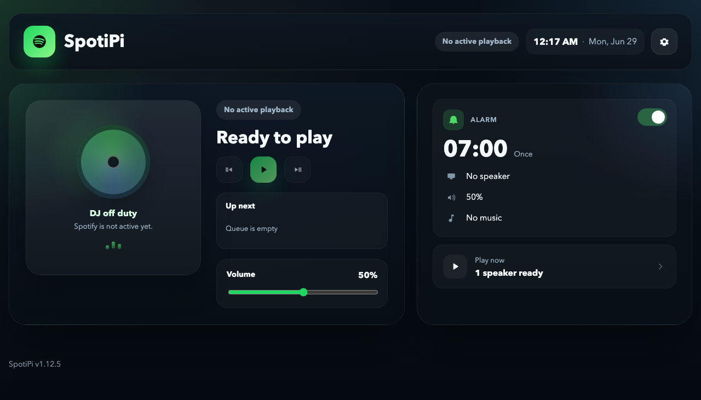

# SpotiPi (v1.5.2)

Smart Spotify alarm clock and sleep timer for Raspberry Pi.

[](https://opensource.org/licenses/MIT)
[](https://www.python.org/downloads/)
[](https://www.raspberrypi.org/)

## Features

- Dashboard-first web UI with persistent player and three primary actions
- Spotify playback for alarms, sleep timer, and direct "play now"
- Touch-friendly mobile sheets for music and device selection
- Local server profile for safe development testing
- Raspberry Pi optimized defaults and low-power toggles
- Resilient alarm scheduler with catch-up behavior
- Encrypted token storage and restricted token file permissions

## Current Runtime Contract

- Supported Python runtime: `3.10+`
- Canonical runtime secrets path: `~/.spotipi/.env`
- `GET /api/dashboard/status` and `GET /playback_status` return `202 Accepted` while snapshot data is still `pending` or `auth_required`
- Health/auth status endpoints stay cache-based and must not block on live Spotify retries

## Quick Start (Local)

```bash
git clone https://github.com/phobo-at/SpotiPi.git
cd SpotiPi
python3 -m venv .venv
source .venv/bin/activate
pip install -r requirements.txt
npm install

mkdir -p ~/.spotipi
cp .env.example ~/.spotipi/.env
# Fill in SPOTIFY_CLIENT_ID, SPOTIFY_CLIENT_SECRET, SPOTIFY_USERNAME
# Optional dev-only overrides can still live in ./ .env, but runtime secrets belong in ~/.spotipi/.env

python generate_token.py
npm run build
./scripts/local_server.sh start
```

Open: [http://127.0.0.1:5001](http://127.0.0.1:5001)

## Frontend Development

The app shell is now built with `TypeScript + Preact` and served by Flask as static assets.

- Source: `frontend/src/`
- Built assets committed for runtime: `static/dist/app.js`, `static/dist/app.css`
- Shell mount point: `templates/index.html`
- Initial bootstrap payload: `src/routes/main.py`

Common frontend commands:

```bash
npm run build
npm run watch
npm run typecheck
```

If you change frontend code, rebuild before running the app or deploying to the Pi.

## Local Server Commands

```bash
./scripts/local_server.sh start
./scripts/local_server.sh stop
./scripts/local_server.sh status
./scripts/local_server.sh logs -f
```

Advanced manager (custom profile/flags):

```bash
./.venv/bin/python scripts/server_manager.py start --profile local
./.venv/bin/python scripts/server_manager.py status --profile local
./.venv/bin/python scripts/server_manager.py logs --profile local -f
```

Local profile log files:

- `logs/server.local.log`
- `logs/server.local.error.log`

## Raspberry Pi Setup

On the Pi:

```bash
git clone https://github.com/phobo-at/SpotiPi.git /home/pi/spotipi
cd /home/pi/spotipi
python3 -m venv venv
source venv/bin/activate
pip install -r requirements.txt
python generate_token.py
./deploy/install.sh
```

From your dev machine (sync + restart service):

```bash
./scripts/deploy_to_pi.sh
```

Useful deploy flags:

- `SPOTIPI_FORCE_SYSTEMD=1` forces systemd unit refresh
- `SPOTIPI_PURGE_UNUSED=1` removes old/unneeded files on the Pi once

## Configuration

Minimum `.env` values:

```env
SPOTIFY_CLIENT_ID=your_client_id
SPOTIFY_CLIENT_SECRET=your_client_secret
SPOTIFY_USERNAME=your_username
```

Canonical runtime path: `~/.spotipi/.env`

Common optional overrides:

```env
SPOTIPI_LOW_POWER=1
SPOTIPI_TIMEZONE=Europe/Vienna
SPOTIPI_MAX_CONCURRENCY=2
SPOTIPI_DEVICE_TTL=10
SPOTIPI_LIBRARY_TTL_MINUTES=60
```

Recommended for shared low-power Pi workloads such as `Pi-hole + SpotiPi`:

```env
SPOTIPI_LOW_POWER=1
SPOTIPI_MAX_CONCURRENCY=2
SPOTIPI_LIBRARY_TTL_MINUTES=60
```

Full environment variable reference: [`docs/ENVIRONMENT_VARIABLES.md`](docs/ENVIRONMENT_VARIABLES.md)

## Architecture

- Flask app entrypoint: `run.py` -> `src/app.py`
- Routes via blueprints in `src/routes/`
- Business logic in `src/services/`, alarm/scheduler in `src/core/`
- Shared config/thread safety helpers in `src/config.py` and `src/utils/thread_safety.py`
- Frontend app shell in `frontend/src/`, bundled into `static/dist/`
- `templates/index.html` now contains only the shell root and bootstrap JSON
- Home screen is dashboard-first; settings open as a secondary surface instead of a separate legacy page

## Testing

```bash
pytest
npm run typecheck
npm run build
npm run test:e2e
```

Current baseline as of 2026-03-18:

- `pytest`: `123 passed, 2 skipped`
- `npm run test:e2e`: `9 passed`

Optional local quality checks:

```bash
pre-commit run --all-files
```

## Documentation

- [`docs/DEPLOYMENT.md`](docs/DEPLOYMENT.md)
- [`docs/ENVIRONMENT_VARIABLES.md`](docs/ENVIRONMENT_VARIABLES.md)
- [`docs/SPOTIFY_API_RETRY.md`](docs/SPOTIFY_API_RETRY.md)
- [`docs/CONFIG_SCHEMA_VALIDATION.md`](docs/CONFIG_SCHEMA_VALIDATION.md)
- [`docs/JSON_LOGGING.md`](docs/JSON_LOGGING.md)

## Screenshot



Regenerate the screenshot and keep README in sync:

```bash
npm run screenshot:readme
```

## Contributing

- Follow [`CONTRIBUTING.md`](CONTRIBUTING.md)
- Follow AI assistant rules in [`AGENTS.md`](AGENTS.md)

## License

MIT
