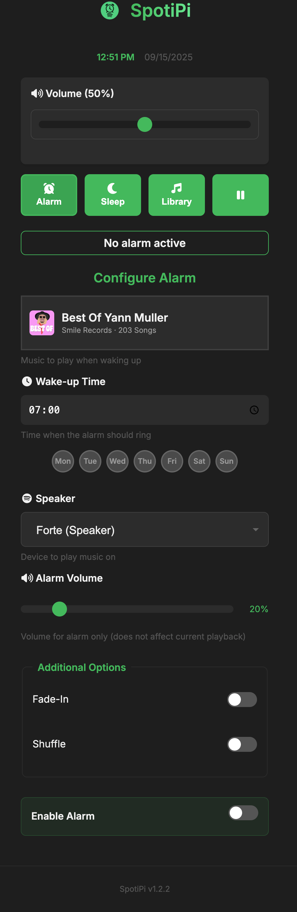

# 🎵 SpotiPi (v1.5.1)

**Smart Spotify alarm clock and sleep timer for Raspberry Pi**

[](https://opensource.org/licenses/MIT)
[](https://www.python.org/downloads/)
[](https://www.raspberrypi.org/)

Wake up to your favorite Spotify music with this elegant web-based alarm system. Features automatic environment detection, mobile-optimized interface, and seamless Raspberry Pi integration.

## ✨ Features

- 🎵 **Spotify Integration** - Wake up to any playlist, album, or track
- ⏰ **Smart Alarms** - Single-use alarms that automatically disable after ringing
- 😴 **Sleep Timer** - Peaceful fade-out for better sleep
- 📱 **Mobile First** - Responsive web interface, PWA support
- 🍓 **Pi Optimized** - Auto-detection and SD-card protection
- ⚡ **Instant First Paint** - Lightweight HTML shell with async hydration
- 🚀 **Fast Dashboard** - Aggregated status updates over a single request
- 🔒 **Secure** - Token encryption at rest, environment variables for credentials
- 📈 **Resilient Alarms** - Monotonic scheduler with catch-up & structured diagnostics
- 🎨 **Modern UI** - Glassmorphism effects, shimmer loading, OLED black mode
- 📳 **Haptic Feedback** - Native-feeling touch interactions on mobile

## 🧱 Architecture

- Flask controllers stay thin—they validate HTTP specifics and delegate business logic to the service layer (`src/services/*`) for shared validation, caching, and state changes.
- Spotify music-library endpoints now hydrate through a single cache & hashing pipeline (`utils.library_utils`), so `/api/music-library` and `/api/music-library/sections` expose identical headers and payload semantics.

## 🚀 Quick Start

```bash
# Clone and setup
git clone https://github.com/phobo-at/SpotiPi.git
cd SpotiPi
python3 -m venv venv && source venv/bin/activate
pip install -r requirements.txt

# Configure Spotify (get credentials from developer.spotify.com)
cp .env.example .env
# Edit .env with your Spotify Client ID and Secret

# Generate token and run
python generate_token.py
python run.py
```

Access at `http://localhost:5001` (development) or `http://spotipi.local:5000` (Pi)

## 🖥️ Server Management (Development)

Use the server manager script for background daemon control during local development:

```bash
python scripts/server_manager.py start    # Start server in background
python scripts/server_manager.py stop     # Stop the server  
python scripts/server_manager.py restart  # Restart (stop + start)
python scripts/server_manager.py status   # Show PID, uptime, memory usage
python scripts/server_manager.py logs     # Last 50 lines of log
python scripts/server_manager.py logs -f  # Follow logs (tail -f)
```

Server runs on **http://localhost:5001**, logs to `logs/server.log`.

## 🔧 Configuration

Create `.env` file (either in the project root for local development or in `~/.spotipi/.env` for deployments):
```env
SPOTIFY_CLIENT_ID=your_client_id
SPOTIFY_CLIENT_SECRET=your_client_secret  
SPOTIFY_USERNAME=your_username

# Optional: Pi Zero / low-power mode optimizations
SPOTIPI_LOW_POWER=1
SPOTIPI_TIMEZONE=Europe/Vienna                 # Override detected timezone for alarms & scheduler
SPOTIPI_DEFAULT_ORIGIN=http://spotipi.local   # CORS allowlist fallback for LAN UI
SPOTIPI_PLAYBACK_CACHE_TTL=3.0                # Seconds to cache /me/player snapshot
SPOTIPI_DEVICE_TTL=10                         # Device cache TTL in seconds (5-15 on Pi Zero)
SPOTIPI_LIBRARY_TTL_MINUTES=60                # Library cache TTL in minutes (30-120)
SPOTIPI_MAX_CONCURRENCY=2                     # Global HTTP concurrency limit on low-power devices
SPOTIPI_CATCHUP_GRACE_SECONDS=600             # Catch-up window in seconds for missed alarms
SPOTIPI_NETWORK_PROBE_HOST=api.spotify.com    # TCP probe host for readiness checks
SPOTIPI_NETWORK_PROBE_TIMEOUT=1.5             # Probe timeout in seconds
SPOTIPI_DNS_PROBE_HOST=api.spotify.com        # DNS probe host for readiness checks
```

Everything else is auto-configured with smart defaults.

### Pi Zero W Tuning

For stable playback on the Pi Zero W, these environment variables work well:

```env
SPOTIPI_HTTP_TIMEOUTS=5,18                 # Generous network/connect + read timeouts
SPOTIPI_STATUS_CACHE_SECONDS=0.8           # Server-side dashboard cache to lighten load
SPOTIPI_PLAYBACK_STATUS_CACHE_SECONDS=0.6  # Server-side playback cache (< 1 second)
SPOTIPI_PREWARM_SECONDS=150                # Token prewarm window ahead of alarm trigger
SPOTIPI_PLAYER_RETRIES=3                   # Playback attempts including exponential backoff
SPOTIPI_PLAYER_BACKOFF=1.0                 # Initial backoff delay in seconds
SPOTIPI_PLAYER_JITTER=0.4                  # Random jitter factor for backoff
SPOTIPI_DEVICE_TTL=10                      # Spotify device cache TTL in seconds
SPOTIPI_CATCHUP_GRACE_SECONDS=600          # Allow alarms to recover within 10 minutes
SPOTIPI_NETWORK_PROBE_HOST=api.spotify.com # Override network probe host if needed
SPOTIPI_DNS_PROBE_HOST=api.spotify.com     # Override DNS probe target
```

Adjust them freely without touching the code—set the values in `.env`, restart the service, and you’re done.

## 🔁 Alarm Reliability

- The alarm scheduler now runs on a monotonic clock, so NTP/DST jumps no longer shrink the trigger window.
- Missed alarms within `SPOTIPI_CATCHUP_GRACE_SECONDS` (default 10 min) are retried automatically after reboots or clock adjustments.
- Readiness probes (network, DNS, Spotify token, device availability) gate each playback attempt with exponential backoff + jitter.
- A lightweight state file (`cache/alarm_scheduler_state.json`) records the next scheduled UTC time and the last successful execution.
- Structured JSON logs are emitted via the `alarm_probe` logger to make journalctl/file log correlation trivial.
- Inspect alarm telemetry on the Pi with `journalctl -u spotipi.service --since "2025-10-20 06:20:00" | rg alarm_probe`, or run the manual probe via `sudo systemctl start spotipi-alarm.service`.

## 🍓 Raspberry Pi Setup

```bash
# On your Pi
git clone https://github.com/phobo-at/SpotiPi.git /home/pi/spotipi
cd /home/pi/spotipi && python3 -m venv venv && source venv/bin/activate
pip install -r requirements.txt && python generate_token.py

# Install/refresh systemd units (service + alarm timer, enabled by default since v1.3.8)
./deploy/install.sh

# Disable the alarm readiness timer if desired (not recommended)
SPOTIPI_ENABLE_ALARM_TIMER=0 ./deploy/install.sh
```

## 🧠 Performance Setup (Pi Zero W)

- **HTTP pooling & limits:** a shared `requests.Session` keeps TLS warm and caps concurrent Spotify API calls (`SPOTIPI_MAX_CONCURRENCY`, default `2`).
- **Two-tier caching:** devices persist to `./cache/spotify_devices_<hash>.json` (default TTL `SPOTIPI_DEVICE_TTL=10s`), the music library uses an in-memory LRU backed by disk (`SPOTIPI_LIBRARY_TTL_MINUTES=60`).
- **Global ThreadPoolExecutor:** library loading reuses a singleton executor (`_get_library_executor()`) to minimize thread creation overhead on resource-constrained devices.
- **Instrumentation:** high-resolution timings for every Flask route plus per-endpoint P50/P95 logs; inspect via `/api/perf/metrics`.
- **Benchmark helpers:** run `scripts/bench.sh` for Spotify API/caching latency and `scripts/bench_first_load.sh` to capture cold/warm TTFB plus first paint metrics (details in `docs/benchmark.md`).

## 🔐 Security

- **Token Encryption at Rest:** Spotify tokens are encrypted using Fernet (from `cryptography` library) or XOR obfuscation fallback. Machine-derived keys ensure tokens can't be transferred between devices.
- **File Permissions:** Token files are created with restricted permissions (0o600 - owner read/write only).
- **Backward Compatible:** Automatically reads legacy plain JSON tokens and re-encrypts on next save.
- **Environment Variables:** All credentials stored in `.env` files, never committed to version control.

## 🚀 Deployment Workflow

```bash
# Sync runtime files to the Pi and restart the systemd service
./scripts/deploy_to_pi.sh

# Optional one-time cleanup of previously deployed unused files
SPOTIPI_PURGE_UNUSED=1 ./scripts/deploy_to_pi.sh

# Install/refresh systemd units on the Pi (after rsync completes)
ssh pi@spotipi.local 'cd /home/pi/spotipi && ./deploy/install.sh'
# Disable the alarm timer during install if desired (not recommended)
ssh pi@spotipi.local 'cd /home/pi/spotipi && SPOTIPI_ENABLE_ALARM_TIMER=0 ./deploy/install.sh'
```
> **Since v1.3.8:** The alarm readiness timer (`spotipi-alarm.timer`) is **enabled by default** for robustness. It provides catch-up after reboot/downtime and runs daily at 05:30 as a backup layer to the in-process scheduler.

> `scripts/deploy_to_pi.sh` now skips copying systemd units when they are unchanged; export `SPOTIPI_FORCE_SYSTEMD=1` to force a refresh.
The deploy script uses an allowlist `rsync` (run.py, requirements, `src/`, `static/`, `templates/`, `config/`), keeping the Raspberry Pi installation minimal.

## 📸 Screenshots


## 🏗️ Architecture

- **Backend**: Flask with modular service architecture
- **Frontend**: Responsive vanilla JS with PWA support
- **Integration**: Spotify Web API with token caching
- **Deployment**: Auto-detection (development vs. Raspberry Pi)

## 📝 Environment Detection

SpotiPi automatically configures itself:
- **macOS/Windows**: Development mode (port 5001, verbose logging)
- **Raspberry Pi**: Production mode (port 5000, minimal logging)
- **Override**: Use environment variables to force specific behavior

## 🤝 Contributing

1. Fork the repository
2. Create feature branch: `git checkout -b feature/name`
3. Install tooling (`pip install pre-commit`) and run `pre-commit install`
4. Run the formatter/linter locally: `pre-commit run --all-files`
5. Execute the test suite: `pytest`
6. Follow the [Contributing Guide](CONTRIBUTING.md)
7. Submit pull request

## 🧪 Development Workflow

- **Tooling**: Formatting and linting are managed via `pre-commit` (Black, Ruff, Prettier). Install once with `pre-commit install`.
- **Tests**: Run `pytest` to execute the in-process API/service suites—no external server required.
- **CI**: GitHub Actions runs the same checks (pre-commit + pytest) on every push/PR.

## 📄 License

MIT License - feel free to use and modify!

## 🤖 Development Story

This app was 100% vibe-coded with GitHub Copilot and an unhealthy amount of ☕ coffee. 
If you find any bugs, blame the caffeine dependency, not the AI! 😄

## 🙏 Credits

Built with Flask, Spotify Web API, and lots of ❤️ for better mornings.

---

**🌅 Made for music lovers who want to wake up right!**
