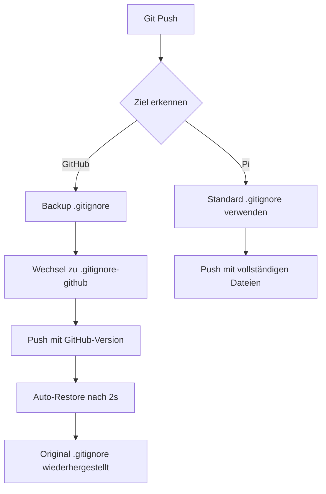

# Git Hooks System für SpotiPi

## Übersicht

SpotiPi verwendet ein intelligentes Git Hooks System für automatisches Deployment mit selektiven `.gitignore` Dateien. Das System unterscheidet automatisch zwischen GitHub Pushes (öffentliches Repository) und Pi Pushes (lokaler Raspberry Pi) und verwendet entsprechend unterschiedliche Dateisätze.

## Funktionsweise

### Zwei .gitignore Dateien

- **`.gitignore`** - Standard-Version für Pi Deployment (permissiv)
- **`.gitignore-github`** - GitHub-Version für öffentliches Repository (restriktiv)

### Automatischer Workflow



## Setup

### 1. Git Remotes konfigurieren

```bash
# GitHub Remote (öffentliches Repository)
git remote add github git@github.com:username/spotipi.git

# Pi Remote (lokaler Raspberry Pi)
git remote add pi pi@raspberrypi.local:/path/to/repo.git
```

### 2. Git Hooks installieren

Die Hooks sind bereits installiert in `.git/hooks/pre-push`. Falls sie fehlen:

```bash
# Hook ausführbar machen
chmod +x .git/hooks/pre-push
```

### 3. .gitignore Dateien prüfen

Beide Dateien müssen existieren:
- `.gitignore` - Standard-Version
- `.gitignore-github` - GitHub-Version (ausschließt mehr Dateien)

## Verwendung

### GitHub Push (automatisch saubere Version)

```bash
# Via Git CLI
git push github master

# Via VS Code: Commit + Push (wenn github als upstream konfiguriert)
```

**Was passiert automatisch:**
1. 🔍 Hook erkennt GitHub Push
2. 💾 Erstellt Backup der aktuellen `.gitignore`
3. 🔄 Wechselt zu `.gitignore-github`
4. 📤 Push erfolgt mit GitHub-Version (ohne sensitive/development Dateien)
5. 🤖 Automatische Wiederherstellung nach 2 Sekunden
6. 🧹 Backup wird aufgeräumt

### Pi Push (vollständige Version)

```bash
git push pi master
```

**Was passiert:**
1. 🍓 Hook erkennt Pi Push
2. 📁 Verwendet Standard `.gitignore`
3. 📤 Push erfolgt mit allen benötigten Dateien

## Unterschiede zwischen den .gitignore Versionen

### Standard .gitignore (für Pi)
```ignore
# Grundlegende Ausschlüsse
*.log
__pycache__/
.vscode/
# ... aber erlaubt wichtige Entwicklungsdateien
```

### .gitignore-github (für öffentliches Repository)
```ignore
# Alle Standard-Ausschlüsse PLUS:
docs/DEPLOYMENT.md          # Private Deployment-Infos
ideen/                      # Entwicklungsnotizen
.env                        # Umgebungsvariablen
config/development.json     # Entwicklungskonfiguration
# ... zusätzliche sensitive Dateien
```

## Technische Details

### Pre-Push Hook Funktionen

1. **Remote-Erkennung:**
   ```bash
   remote_url=$(git remote get-url "$remote_name" 2>/dev/null)
   if [[ "$remote_url" == *"github.com"* ]]
   ```

2. **Automatisches Backup:**
   ```bash
   cp .gitignore .gitignore-backup
   ```

3. **Hintergrund-Wiederherstellung:**
   ```bash
   (auto_restore_gitignore) &
   ```

### Fehlerbehebung

#### Problem: Hook wird nicht ausgeführt
```bash
# Prüfe Hook-Berechtigungen
ls -la .git/hooks/pre-push

# Falls nicht ausführbar:
chmod +x .git/hooks/pre-push
```

#### Problem: .gitignore wird nicht wiederhergestellt
```bash
# Manuell wiederherstellen falls Backup existiert
if [ -f .gitignore-backup ]; then
    mv .gitignore-backup .gitignore
fi
```

#### Problem: Falsche Remote-Erkennung
```bash
# Prüfe Remote-URLs
git remote -v

# Korrekte URLs:
# github  git@github.com:username/spotipi.git
# pi      pi@raspberrypi.local:/path/to/repo.git
```

## Logging und Debugging

### Hook-Ausgaben verstehen

**GitHub Push Meldungen:**
```
🔍 Push zu Remote: github (git@github.com:username/spotipi.git)
📤 GitHub Push erkannt - aktiviere .gitignore-github
💾 Backup erstellt: .gitignore-backup
🔄 GitHub .gitignore aktiviert
🤖 Auto-Restore in 2s gestartet
✅ GitHub Push vorbereitet
```

**Pi Push Meldungen:**
```
🔍 Push zu Remote: pi (pi@raspberrypi.local:/path/to/repo.git)
🍓 Pi Push erkannt - Standard .gitignore beibehalten
```

### Manuelles Testen

```bash
# Aktuell aktive .gitignore prüfen
tail -3 .gitignore

# Standard-Version sollte enden mit: ".gitignore-github"
# GitHub-Version sollte enden mit: "docs/DEPLOYMENT.md"

# Test-Push zu GitHub
git commit --allow-empty -m "Test: Hook System"
git push github master

# Nach 3 Sekunden prüfen:
sleep 3 && tail -3 .gitignore
```

## Wartung

### Hook aktualisieren

1. Hook-Datei bearbeiten: `.git/hooks/pre-push`
2. Ausführbar machen: `chmod +x .git/hooks/pre-push`
3. Testen mit Test-Push

### .gitignore Dateien synchronisieren

Wenn sich Anforderungen ändern:

1. **Standard `.gitignore` aktualisieren** (für Pi)
2. **`.gitignore-github` entsprechend anpassen** (restriktiver)
3. **Testen** mit beiden Push-Zielen

## Sicherheitshinweise

- ⚠️ **Niemals sensitive Daten in .gitignore-github auskommentieren**
- ⚠️ **Pi-spezifische Konfigurationen nicht zu GitHub pushen**
- ✅ **Regelmäßig beide .gitignore Dateien überprüfen**
- ✅ **Hook-Funktionalität regelmäßig testen**

## Troubleshooting

| Problem | Lösung |
|---------|--------|
| Hook läuft nicht | `chmod +x .git/hooks/pre-push` |
| Falsche .gitignore aktiv | Manuell wiederherstellen: `mv .gitignore-backup .gitignore` |
| Backup-Dateien bleiben | `rm .gitignore-backup` nach erfolgreichem Push |
| Remote nicht erkannt | `git remote -v` prüfen und URLs korrigieren |

## Automatisierung Status

✅ **Vollautomatisch** - Kein manueller Eingriff erforderlich  
✅ **VS Code kompatibel** - Funktioniert mit "Commit + Push"  
✅ **Selbst-aufräumend** - Backup-Dateien werden automatisch entfernt  
✅ **Fehlerresistent** - Fallback-Mechanismen für Edge Cases  

---

*Erstellt: August 2025*  
*Letzte Aktualisierung: August 2025*
