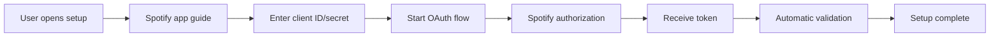

# SpotiPi Configuration Management - Roadmap

*Web-based Spotify configuration and advanced settings*

## 🎯 **Vision: Self-Service Setup**

Users should be able to set up SpotiPi completely through the web interface, without SSH or filesystem access. One-click setup from first start to functional installation.

## 🚀 **Phase 1: Spotify Connection Setup (4-6 weeks)**

### Core Features
- [ ] **Setup Wizard**: Guided initial setup on first start
- [ ] **Spotify App Registration**: Step-by-step guide + links
- [ ] **Token Generation**: Integrated OAuth flow without external tools
- [ ] **Connection Testing**: Automatic validation of Spotify connection

### Technical Implementation
```
/config-wizard/
├── step-1-welcome.html        # Welcome + overview
├── step-2-spotify-app.html    # Create Spotify app
├── step-3-oauth.html          # OAuth flow
├── step-4-test.html           # Test connection
└── step-5-complete.html       # Setup complete
```

### Backend Components
```python
# src/routes/config.py
config_bp = Blueprint("config", __name__)

@config_bp.route("/setup/spotify/oauth")
def spotify_oauth_start():
    # Initialize OAuth flow
    
@config_bp.route("/setup/spotify/callback") 
def spotify_oauth_callback():
    # Receive and save token
    
@config_bp.route("/setup/test-connection")
def test_spotify_connection():
    # Validate connection
```

## 🔧 **Phase 2: Advanced Configuration UI (2-3 weeks)**

### Settings Categories
- [ ] **Spotify Settings**: Token management, API limits, retry behavior
- [ ] **Network Settings**: CORS, rate limiting, mDNS name
- [ ] **System Settings**: Logging level, cache sizes, auto-updates
- [ ] **Alarm Settings**: Default volumes, fade times, device preferences

### UI Components
```typescript
interface ConfigSection {
  id: string;
  title: string;
  description: string;
  settings: ConfigSetting[];
}

interface ConfigSetting {
  key: string;
  type: 'text' | 'number' | 'boolean' | 'select' | 'password';
  value: any;
  validation?: ValidationRule[];
  helpText?: string;
}
```

### Advanced Features
- [ ] **Config Import/Export**: JSON-based configuration backup
- [ ] **Environment Detection**: Automatic Pi vs. development settings
- [ ] **Backup System**: Automatic config backups before changes
- [ ] **Reset Options**: Factory reset + selective reset

## 🌐 **Phase 3: OAuth Integration & Security (3-4 weeks)**

### Spotify OAuth Flow


### Security Implementation
- [ ] **Secure Token Storage**: Encrypted `.env` files
- [ ] **PKCE OAuth Flow**: Security best practice for public clients
- [ ] **Token Rotation**: Automatic refresh token renewal
- [ ] **Config Encryption**: Store sensitive data encrypted

### User Experience
- [ ] **Guided Tutorial**: Screenshots + video links for Spotify app setup
- [ ] **Error Recovery**: Detailed error diagnosis for OAuth problems
- [ ] **Status Dashboard**: Live status of Spotify connection
- [ ] **Re-Authorization**: Simple token renewal without complete setup

## 📱 **Phase 4: Mobile-Optimized Config (2 Wochen)**

### Mobile Configuration Experience
- [ ] **Touch-Optimized Forms**: Große Input-Felder, Touch-Targets
- [ ] **Progressive Disclosure**: Erweiterte Settings nur auf Anfrage
- [ ] **Gesture Navigation**: Swipe zwischen Setup-Schritten
- [ ] **QR Code Integration**: Einfache Übertragung von Spotify-URLs

### Mobile-Specific Features
- [ ] **Camera Integration**: QR-Code Scanner für Client-Secret
- [ ] **Clipboard Integration**: Automatisches Einfügen von Spotify-Daten
- [ ] **Haptic Feedback**: Bestätigungen bei erfolgreichen Steps
- [ ] **Offline Indicators**: Klare Meldung wenn Internet fehlt

## 🔄 **Phase 5: Advanced Management Features (4-5 Wochen)**

### Multi-Device Management
- [ ] **Device Groups**: Logische Gruppierung von Spotify-Geräten
- [ ] **Priority Settings**: Bevorzugte Devices für Alarm/Sleep
- [ ] **Device Health**: Status-Monitoring aller registrierten Geräte
- [ ] **Auto-Discovery**: Automatische Erkennung neuer Spotify-Geräte

### Configuration Profiles
- [ ] **User Profiles**: Verschiedene Nutzer-Konfigurationen
- [ ] **Scene Management**: Vordefinierte Alarm/Sleep-Szenarien
- [ ] **Schedule Profiles**: Wochentag-spezifische Konfigurationen
- [ ] **Backup Strategies**: Automatisierte Config-Sicherung

### System Integration
- [ ] **Home Assistant Integration**: Config-Sync mit HA
- [ ] **Network Scanning**: Automatische Erkennung anderer SpotiPi-Instanzen
- [ ] **Update Management**: Automatische Updates mit Config-Preservation
- [ ] **Migration Tools**: Update von Legacy-Konfigurationen

## 🛠️ **Technical Architecture**

### Config Storage Strategy
```yaml
# config/runtime.json (Encrypted)
spotify:
  client_id: "encrypted_value"
  client_secret: "encrypted_value"
  access_token: "encrypted_value"
  refresh_token: "encrypted_value"
  
system:
  device_name: "SpotiPi-Living"
  network:
    cors_origins: ["192.168.1.*"]
    rate_limits:
      api: 100/minute
      config: 10/minute
      
user_preferences:
  default_volume: 50
  fade_duration: 30
  preferred_devices: ["Sonos Living", "Echo Dot"]
```

### API Endpoints
```python
# Configuration Management API
POST /api/config/spotify/setup     # OAuth Flow initiieren
GET  /api/config/spotify/status    # Verbindungsstatus prüfen
POST /api/config/spotify/refresh   # Token erneuern

GET  /api/config/sections          # Alle Config-Bereiche
PUT  /api/config/{section}         # Section-spezifische Updates
POST /api/config/backup            # Backup erstellen
POST /api/config/restore           # Backup wiederherstellen

GET  /api/config/schema            # Frontend Config-Schema
POST /api/config/validate          # Config-Validierung
POST /api/config/reset             # Factory Reset
```

### Frontend State Management
```javascript
// Configuration Store (Vue/React)
const configStore = {
  state: {
    sections: [],
    currentSection: null,
    isSetupComplete: false,
    spotifyStatus: 'disconnected'
  },
  
  mutations: {
    SET_CONFIG_SECTION(state, section) { ... },
    UPDATE_SPOTIFY_STATUS(state, status) { ... }
  },
  
  actions: {
    async loadConfiguration() { ... },
    async saveConfiguration(section, data) { ... },
    async testSpotifyConnection() { ... }
  }
}
```

## 📋 **Implementation Roadmap**

### Sprint 1 (2 Wochen) - Foundation
- Config-Blueprint erstellen
- Basic Setup-Wizard UI
- Spotify OAuth Flow (Backend)
- Token Storage System

### Sprint 2 (2 Wochen) - Core Setup
- Setup-Wizard Frontend
- Spotify App Registration Guide
- Connection Testing
- Error Handling & Recovery

### Sprint 3 (2 Wochen) - Advanced Config
- Settings Categories UI
- Config Validation System
- Import/Export Functionality
- Mobile Optimizations

### Sprint 4 (2 Wochen) - Security & Polish
- Config Encryption
- PKCE OAuth Implementation  
- User Testing & Bug Fixes
- Documentation & Help System

### Sprint 5 (2 Wochen) - Advanced Features
- Device Management
- Profile System
- System Integration Prep
- Performance Optimization

## 🎨 **User Experience Flow**

### First-Time Setup
1. **Welcome Screen**: "Willkommen bei SpotiPi! Lass uns deine Spotify-Verbindung einrichten."
2. **Spotify App Guide**: Step-by-Step mit Screenshots für Spotify Developer Dashboard
3. **OAuth Flow**: "Autorisiere SpotiPi bei Spotify" → Redirect → Callback
4. **Connection Test**: Automatischer Test mit Device-Discovery
5. **Completion**: "🎉 Setup erfolgreich! Dein erster Alarm ist bereit."

### Daily Configuration
- **Quick Settings**: Häufige Einstellungen direkt auf Hauptseite
- **Advanced Config**: Detaillierte Einstellungen in separater Config-Seite
- **Status Indicators**: Spotify-Verbindung, System-Health immer sichtbar
- **One-Click Actions**: Token erneuern, Devices neu scannen, Config-Backup

### Error Recovery
- **Connection Lost**: "Spotify-Verbindung verloren - [Token erneuern] [Setup wiederholen]"
- **Invalid Config**: "Konfigurationsfehler erkannt - [Automatisch reparieren] [Backup laden]"
- **API Limits**: "Spotify-API-Limit erreicht - Versuche es in X Minuten erneut"

## ⚡ **Quick Wins (Erste 2 Wochen)**

### MVP Features
- [ ] **Basic Config Page**: `/config` Route mit einfachen Einstellungen
- [ ] **Spotify Token Input**: Manuelle Token-Eingabe mit Validierung
- [ ] **Connection Status**: Live-Anzeige der Spotify-Verbindung
- [ ] **Config Persistence**: Sichere Speicherung in JSON-Config

### Implementation
```python
# Minimal MVP für sofortigen Nutzen
@app.route("/config")
def config_page():
    return render_template('config.html', 
                         current_config=load_config(),
                         spotify_status=get_spotify_status())

@app.route("/config/spotify", methods=["POST"])
def update_spotify_config():
    # Token validieren und speichern
    # Verbindung testen
    # Feedback an User
```

---

**Geschätzter Gesamtaufwand:** 12-16 Wochen
**Empfohlenes Vorgehen:** MVP zuerst (2 Wochen), dann iterative Erweiterung
**ROI:** Massiv erhöhte Benutzerfreundlichkeit, reduzierter Support-Aufwand
